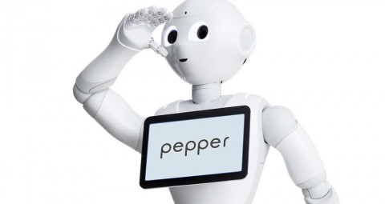

# Image Filtering for Pepper Navigation

Filtrer les images permet de sélectionner celles qui contiennent le plus d'informations nécessaires à la navigation du robot. 

Ainsi, on économise en bande passante et en ressources sur le Robot et les machines qui souscrivent aux topic ROS.



Notre démarche s'articule ainsi :

- Etudier les méthodes de filtrages
  - Variation du Laplacien
  - Maximum du Laplacien
  - Convolutional Neural Network
  
- Etudier les capacités de compression
  - [image_transport](http://wiki.ros.org/image_transport)
  - [compressed_image_transport](http://wiki.ros.org/compressed_image_transport)

- Modifier le [Naoqi Driver](https://github.com/ros-naoqi/naoqi_driver)

Enfin, nous réaliserons une étude des gains lors d'un scénario de navigation

## Pré-requis

### Récupérer les données 

> Il faut avoir ROS installé sur la machine et avoir cv_bridge

Utiliser les données depuis un rosbag : dump des messages ROS envoyés par le robot lors de son fonctionnement.

``` bash
python ext.py --bag_file ./rosbag/2019-07-06-20-25-42.bag --output_dir ./dataset --image_topic "/pepper_robot/camera/front/image_raw"
```